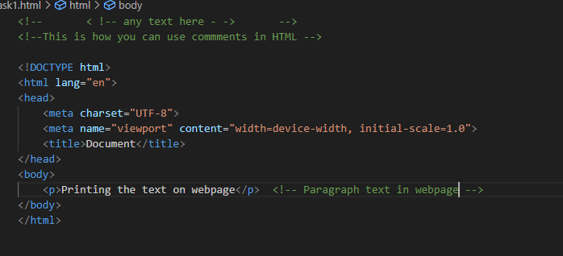
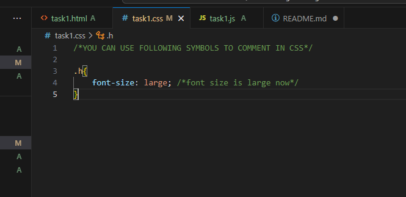
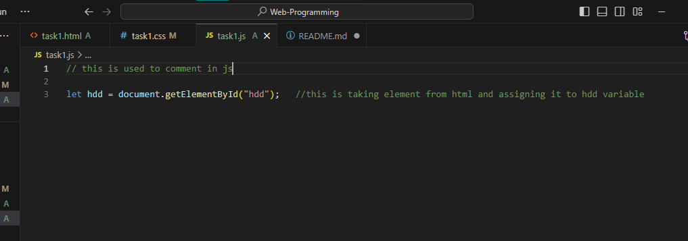
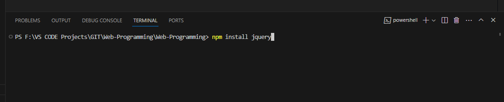
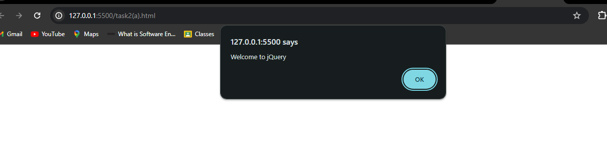
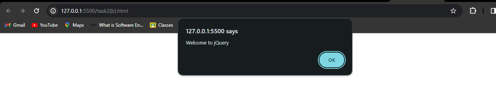

# TASK1

## HTML Comments screenshot

this screenshot contains the HTML code with comments in it

## CSS Comments Screenshot

this screenshot contains the CSS code with comments in it

## JS Comments Screenshot

this screenshot contains the JS code with comments in it

# TASK2

installing jquery

downlaod method output

CDN method output