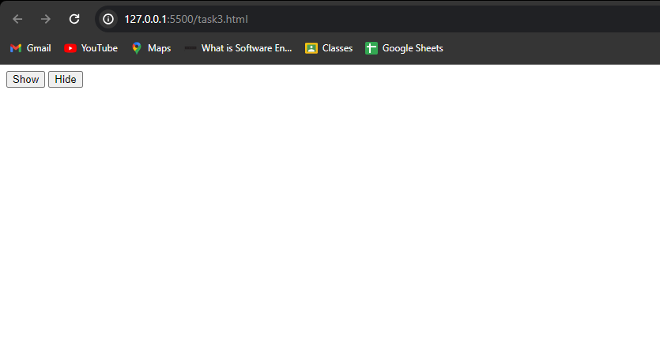
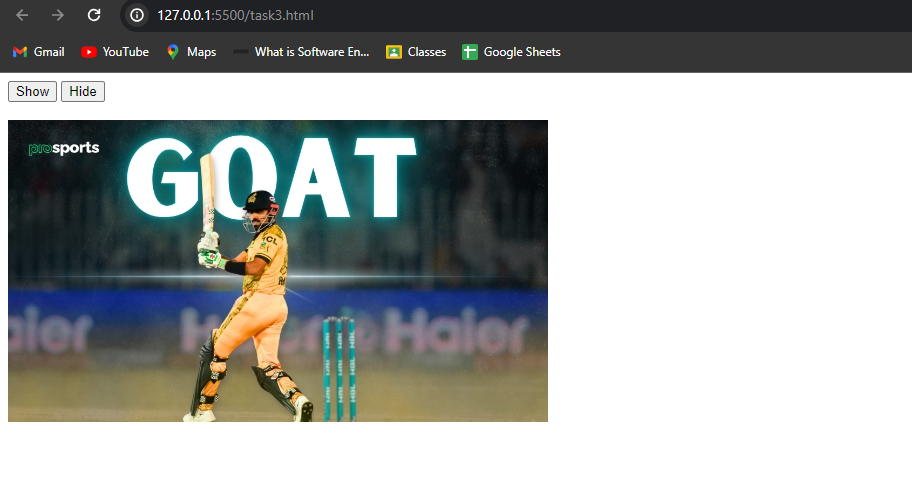
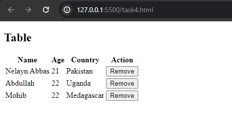
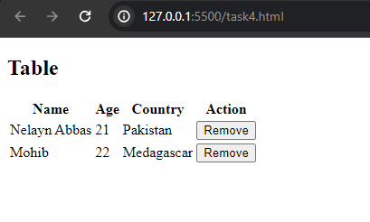
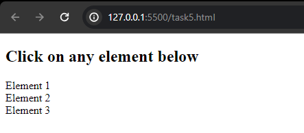
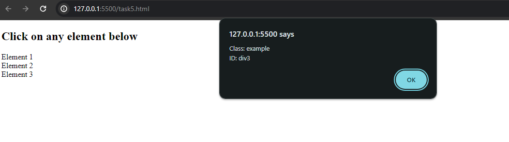
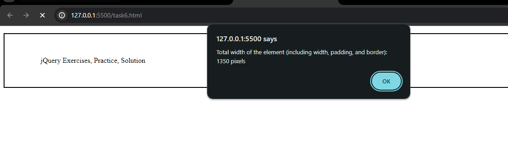
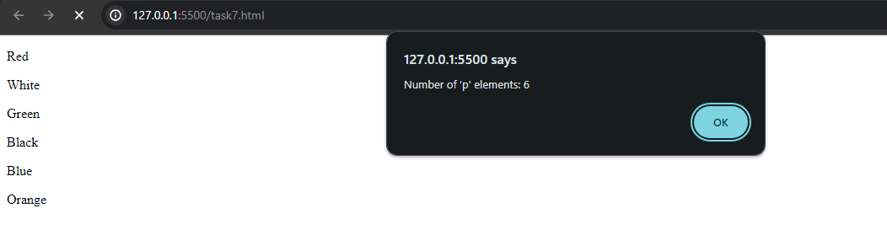

# TASK1

## HTML Comments screenshot

this screenshot contains the HTML code with comments in it

## CSS Comments Screenshot

this screenshot contains the CSS code with comments in it

## JS Comments Screenshot

this screenshot contains the JS code with comments in it

# TASK2

installing jquery

downlaod method output

CDN method output

# TASK3

HIDDEN PIC

After Clicking Show Button

# TASK4

all rows

one row removed by clicking the remove button

# TASK5

ELEMENTS

showing its class and ids in alert

# TASK6

width shown in alert message

# TASK7

TOTAL ELEMENTS SHOWN IN ALERT MESSAGE